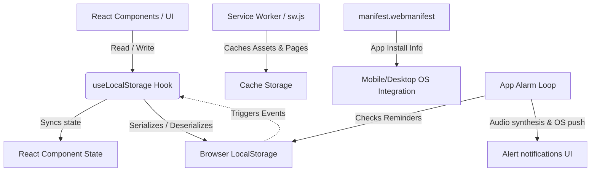

# F'Cube Monitor - Application Documentation

This documentation outlines the system architecture, directory structure, database schemas, color palettes, and deployment guides for **F'Cube Monitor**, a Progressive Web Application (PWA) styled as an engineering pocket terminal mockup.

---

## 1. System Architecture Overview

F'Cube Monitor is a **Local-First, Mobile-Centered Progressive Web Application (PWA)**. It is built to run entirely inside a sandboxed client environment, ensuring 100% privacy, local execution, and complete offline capability.

### Data & State Flow Diagram



### Key Architectural Pillars:
1. **Local-First Storage:** All kebiasaan, catatan, log inventory, alram, dan notifikasi tersimpan langsung di browser client (`LocalStorage`).
2. **Centered Pocket Layout:** Pada desktop, aplikasi dibungkus di dalam wadah berukuran handphone (`max-w-md`) dengan dekorasi garis gambar teknik, sedangkan di perangkat mobile asli ia akan meluas secara penuh (fluid).
3. **PWA & Offline Registry:** Pendaftaran Service Worker (`sw.js`) menggunakan native register script pada `src/main.tsx` untuk melakukan caching aset secara dinamis (Network-First with Cache-Fallback).
4. **JetBrains Mono Typography:** Menggunakan jenis huruf JetBrains Mono untuk seluruh tulisan guna memberikan nuansa konsol industri teknik yang presisi.

---

## 2. Directory Structure

```text
c:/F'Cube/
├── public/
│   ├── manifest.webmanifest      # PWA App configuration manifest
│   ├── sw.js                     # Service Worker kustom (offline caching)
│   ├── favicon.ico               # Favicon
│   └── icons/                    # App icons for installation
│       ├── icon-192.png
│       └── icon-512.png
├── src/
│   ├── components/
│   │   ├── BottomNav.tsx         # Bottom navigation control strip
│   │   ├── Dashboard.tsx         # Analytics index, checklist widget, & urgent needs alerts
│   │   ├── HabitTracker.tsx      # Routines tracker with expandable weekday alarm schedulers
│   │   ├── DocumentManager.tsx   # Markdown notes with mobile catalog drill-down
│   │   └── NeedsLogger.tsx       # Resource checklist ("Apa Saja Yang Dibutuhkan")
│   ├── hooks/
│   │   └── useLocalStorage.ts    # React state synchronization hook for LocalStorage
│   ├── App.tsx                   # Handheld layout frame, clocks, & background alarm loops
│   ├── main.tsx                  # React entry point with custom sw registry
│   ├── vite-env.d.ts             # TypeScript environment declarations
│   └── index.css                 # Styling directives (JetBrains Mono & Tailwind v4 theme)
├── index.html                    # Root index template page
├── package.json                  # Dependencies list
├── CHANGELOG.md                  # Detailed release tracking
├── tsconfig.json                 # TS base configs
└── APP_DOCUMENTATION.md          # Architectural and operational documentation
```

---

## 3. Database Schema

### 3.1. Habits Table (`my-monitor-habits`)
```typescript
interface Habit {
  id: string;
  name: string;
  description: string;
  type: 'good' | 'bad';
  frequency: 'daily';
  createdAt: string;
  history: {
    [dateStr: string]: boolean; // Key: "YYYY-MM-DD", Value: true if completed (for good) or lapsed (for bad)
  };
}
```

### 3.2. Notes & Documents Table (`my-monitor-notes`)
```typescript
interface DocumentNote {
  id: string;
  title: string;
  content: string; // Raw Markdown text
  tags: string[];
  createdAt: string;
  updatedAt: string;
}
```

### 3.3. Resource Needs Table (`my-monitor-needs`)
```typescript
interface NeedItem {
  id: string;
  name: string;
  category: string;
  qty: number;
  estimatedCost: number;
  link: string;
  priority: 'low' | 'medium' | 'high';
  status: 'needed' | 'purchased' | 'researched';
  notes: string;
  updatedAt: string;
}
```

### 3.4. Alarm Reminders Table (`my-monitor-reminders`)
```typescript
interface ReminderItem {
  id: string;
  title: string;
  time: string; // "HH:MM"
  days: string[]; // e.g. ["Mon", "Wed", "Fri"]
  isActive: boolean;
  habitId?: string;
  lastTriggeredDate?: string; // YYYY-MM-DD
}
```

### 3.5. System Notifications Table (`my-monitor-notifications`)
```typescript
interface NotificationItem {
  id: string;
  title: string;
  message: string;
  time: string; // ISO String
  read: boolean;
  type: 'info' | 'alert' | 'success';
}
```

---

## 4. Color Palette & Aesthetics

Semua style mengacu pada aturan **Engineering Blueprint Schematic** di `design.md`:

| Token | Warna Asli | Kode HEX | Deskripsi |
| :--- | :--- | :--- | :--- |
| **Background** | Deep Slate Blue | `#0b1623` | Latar belakang primer shell & cards |
| **Text** | Off-White | `#f0f0f0` | Label teks primer |
| **Accent / Warn** | Amber Orange | `#ff9f30` | Peringatan, alarm, tombol CTA, & item aktif |
| **Grid Lines** | Charcoal Blue | `#1c2b3a` | Bingkai border pembatas & grid latar belakang |
| **Dim Text** | Slate Blue | `#8b9bb4` | Deskripsi teks sekunder / dim |
| **Success** | Neon Green / Cyan | `#00ff9d` | Rutinitas selesai & item telah dibeli |

* **Sudut Border (Shapes):** Seluruh border menggunakan kelengkungan **strictly 0px** (sudut tajam / `rounded-none`).
* **Motion & Animasi:** Animasi minimum. Hanya transisi hover sederhana (150ms) dan geser laci notifikasi (`animate-slide-in-right`).

---

## 5. Deployment Guide

Aplikasi ini dapat disebarkan secara gratis di Vercel:
1. Hubungkan project lokal Anda ke akun GitHub Anda.
2. Buka [Vercel Dashboard](https://vercel.com/dashboard) dan import repositori GitHub tersebut.
3. Vercel akan mendeteksi framework Vite secara otomatis. Klik **Deploy**.
4. Project Anda akan live dalam beberapa detik dan siap diinstal sebagai aplikasi PWA!
